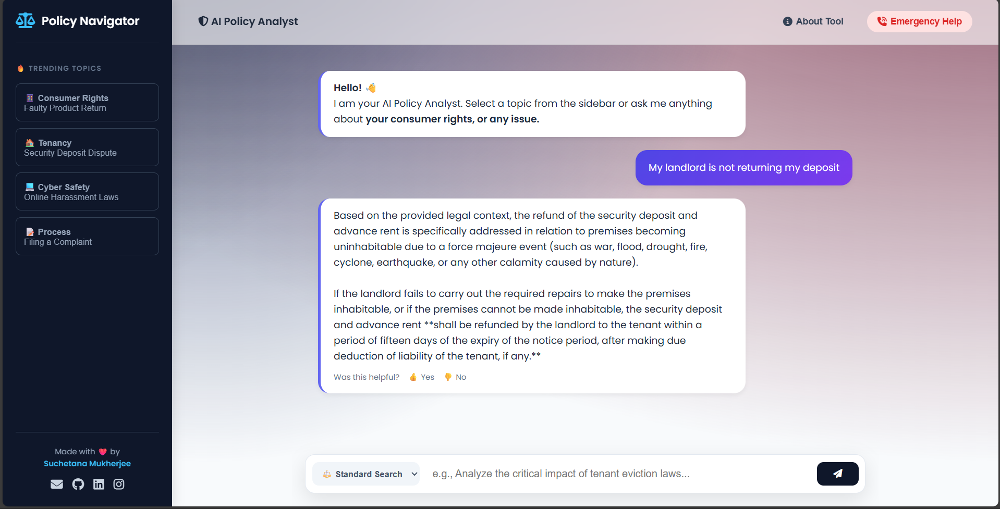

# 📜 Policy Document Navigator

**An AI-powered legal assistant that simplifies complex policy documents using RAG (Retrieval-Augmented Generation) and Google Gemini.**

---

## 🚀 Live Demo & MVP
- **Live Site:** [[Policy_document_Navigator.com](https://huggingface.co/spaces/iamsuchetana01/Policy-document-Navigator)]
- **Demo Video:** [[Policy_document_Navigator_video](https://www.youtube.com/watch?v=6UxSFcYDNQQ)]

### 📸 Screenshot

*Above: The main chat interface where users interact with legal documents.*

---

## 📖 About The Project

Understanding legal documents, government policies, and acts can be overwhelming due to complex jargon and lengthy texts. **Policy Navigator** is a web application designed to bridge this gap. 

It allows users to interact with specific legal documents (like the *Bharatiya Nyaya Sanhita*, *Consumer Protection Act*, etc.) through a simple chat interface. By leveraging **Retrieval-Augmented Generation (RAG)**, the application retrieves exact sections from the document and uses Google's **Gemini Pro** model to explain them in simple, easy-to-understand English.

### ✨ Key Features
* **📄 Document Ingestion:** Processes and indexes PDF documents (e.g., Tenancy Acts, Consumer Rights).
* **🤖 AI-Powered Explanations:** Uses Google Gemini to translate legal clauses into plain language.
* **🔍 Context-Aware Search:** Fetches only the relevant sections of the law to answer user queries accurately (RAG).
* **📱 Responsive Design:** Fully optimized chat interface for both desktop and mobile users.
* **⚡ Real-time Citations:** (Optional) Can refer to specific sections/articles.

---

## 🛠️ Tech Stack

### Frontend
*  **HTML5 & CSS3** - For structure and responsive styling.
*  **Vanilla JavaScript** - For handling API calls and chat UI logic.

### Backend & AI
*  **Python 3.x** - Core logic.
*  **Flask** - Web server and API handling.
*  **LangChain** - Framework for orchestration and RAG.
*  **Google Gemini API** - LLM for generating responses.
* **ChromaDB** - Vector database for storing document embeddings.

---

## ⚙️ How It Works (Architecture)

1.  **Ingestion (`ingest.py`):** The system loads PDF files, splits them into smaller text chunks, and creates vector embeddings using Google's embedding models.
2.  **Storage:** These embeddings are stored locally in **ChromaDB**.
3.  **Retrieval:** When a user asks a question, the system searches ChromaDB for the most relevant text chunks.
4.  **Generation:** The relevant chunks + the user's question are sent to **Gemini**, which generates a precise answer based *only* on the provided context.

---

## 💻 Local Installation Guide

Follow these steps to run the project on your local machine.

### Prerequisites
* Python 3.10 or higher installed.
* A Google Cloud API Key (for Gemini).

### Step 1: Clone the Repository
```bash
git clone [https://github.com/YOUR_USERNAME/policy-navigator.git](https://github.com/YOUR_USERNAME/policy-navigator.git)
cd policy-navigator
```

### Step 2: Create a Virtual Environment (Recommended)
Bash
## Windows
```bash
python -m venv .venv
.venv\Scripts\activate
```


## Mac/Linux
```bash
python3 -m venv .venv
source .venv/bin/activate
```
### Step 3: Install Dependencies
```bash
pip install -r requirements.txt
```
### Step 4: Configure Environment Variables
* Create a .env file in the root directory and add your API key:

```bash
GEMINI_API_KEY=your_actual_api_key_here
```
### Step 5: Ingest Documents
* Before running the app, you need to process the PDFs.

```bash
python ingest.py
```
* This will create the chroma_db folder.

### Step 6: Run the Application
```bash
python app.py
```

* Open your browser and navigate to: http://127.0.0.1:5000

---

### 📂 Project Structure
```Plaintext
policy-navigator/
├── data/                  # Folder containing source PDF files
├── static/                # CSS and JavaScript files
│   ├── style.css
│   └── script.js
├── templates/             # HTML templates
│   └── index.html
├── chroma_db/             # Vector database (generated after ingestion)
├── app.py                 # Main Flask application
├── ingest.py              # Script to process PDFs
├── requirements.txt       # Project dependencies
└── .env                   # API Keys (Not uploaded to GitHub)
```
---

### 🔮 Future Scope
* Upload Feature: Allow users to upload their own PDFs to chat with.

* Multi-Language Support: Support for Indian regional languages using Gemini's translation capabilities.

* Voice Interface: Voice-to-text integration for easier accessibility.

---

### 👤 Author
Suchetana Mukherjee

* GitHub: [[Suchetana.GitHub](https://github.com/mukherjeesuchetana514-maker)]

* LinkedIn: [[Suchetana.LinkedIn](https://www.linkedin.com/in/suchetana-mukherjee-5a7873366/)]

Built with ❤️ for simplifying legal literacy.
